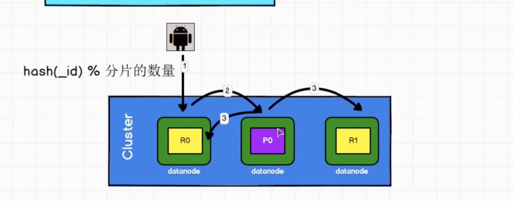

# ElasticSearch 面试指南

## ElasticSearch 面试常问的问题

#### **OpenSearch 与 ElasticSearch 的联系与区别？**

1. OpenSearch 和 ElasticSearch 都是基于 Lucene 的分布式开源搜索和分析引擎。它们具有许多相似之处,但也存在一些差异。
2. 相同点:

   1. 核心功能相似:两者都支持全文检索、分布式索引和搜索功能。
   2. 基于 Lucene:它们都基于 Lucene 构建,Lucene 是一个高性能的全文检索库。
   3. 分布式架构:都采用分布式架构,支持横向扩展以提高性能和容错能力。
   4. RESTful API:都提供了 RESTful API 用于数据操作和管理。
   5. 查询语言:支持类似的查询语言,如结构化查询(SQL)、全文查询等。
3. 不同点:

   1. 许可证:ElasticSearch 在 2021 年后切换到了更加商业化的许可证,而 OpenSearch 则采用了更加开源友好的 Apache 2.0 许可证。
   2. 开源社区:由于许可证的变化,OpenSearch 吸引了一部分原先 ElasticSearch 的开源社区。
   3. 生态系统:ElasticSearch 拥有更成熟的商业生态系统,如 Elastic Cloud、Kibana 等工具。而 OpenSearch 则主要依赖于开源社区的贡献。
   4. 安全性:ElasticSearch 提供了更多的安全特性,如安全性插件、角色权限管理等,而 OpenSearch 在这方面略显落后。
   5. 性能:由于 OpenSearch 是基于 ElasticSearch 的分支,在性能上存在一定差距,但随着时间的推移,这种差距可能会缩小。

#### 为什么要使用ElasticSearch?

1. 灵活索引，我们将id，日期，以及其他id类型的业务数据像：FCid，fnsku，asin，sellerid 加入index中，使得业务服务可以活组合使用索引。如果使用RDS，需要不停的建立新索引，并且查询时必须遵循最左匹配原则。
2. 动态数据结构：Elasticsearch 使用 JSON 格式存储数据，具有灵活的数据模型，支持动态映射和自定义字段，适应各种类型和格式的数据存储和检索需求
3. 近实时写入：refresh 之后能就查到，这个时间默认是1s。
4. 模糊查询：对于RDS，模糊查询会导致全表扫描，而ES因为倒排索引，
5. 分布式架构利于水平扩展。
6. 开发者友好：ES 提供了友好的 Resful API，和客户端。
7. 但是 ES 也不是银弹，不擅长处理复杂的事务操作，关联等。

#### ElasticSearch Master 节点的职责？

1. Master节点负责管理集群，节点，索引。不管理文档数据。
2. 集群管理：
3. 索引创建删除
4. 集群扩展缩减
5. 请求路由

#### ElasticSearch Master 的选举流程？

ElasticSearch 集群通过主节点 (Master Node) 来管理整个集群的状态,比如添加或删除节点等。主节点的选举过程如下:

1. 初始阶段,集群中没有主节点存在。集群状态为红色。
2. 如果一个有资格成为主节点的节点启动,它会通过广播消息的方式试图去发现集群中的所有节点。
3. 每个符合条件的节点都会为自己分配一个节点级别的唯一编号,并在内存中为自己投票。
4. 所有投票将被收集和计算。获得大多数(n/2+1)"票"的节点将被选举为主节点。
5. 如果有两个节点获得相同数量的最高票数,则使用节点的唯一编号来决定谁将成为主节点,编号较小的节点将成为主节点。
6. 一旦主节点被选出,其它节点将被重置为数据节点,状态将变为黄色。当所有数据都被分配后,状态将变为绿色。

   主节点的选举是完全自动化和去中心化的过程。如果当前主节点出现故障,数据节点将再次发起选举投票选出新的主节点。

   需要注意的是,每个能够成为主节点的节点都必须正确配置以下设置:

```
	node.master: true  #允许节点成为主节点
	node.data: true/false  #节点是否保存数据
	discovery.zen.ping.unicast.hosts: ...  #指定集群其他节点的地址列表，可以是 data node 也可以是 master node。
```

    通过配置合理的故障转移策略和资源,可以确保主节点选举的高可用性。

#### ZenDiscovery 和 Unicast 在这个过程中扮演了什么角色

在ElasticSearch主节点选举过程中,ZenDiscovery和Unicast扮演着非常重要的角色:

1. ZenDiscovery
   ZenDiscovery是ES集群节点发现和主节点选举的模块。它基于全互联网络通信和最小化的集群状态传播,对分布式系统中的节点发现和主节点选举提供了解决方案。

   ZenDiscovery的主要作用包括:

* 发现集群中的数据节点和主节点
* 对新加入的节点进行发现和集群入口点分配
* 与主节点通信,接收集群状态的更新
* 参与主节点选举,尝试对自己投票

2. Unicast
   Unicast指的是ES使用Unicast发现机制来发现集群中其他节点的实例及其状态。Unicast发现使用的是单播通信方式,与广播相比可以减少网络流量。

Unicast发现的工作过程如下:

* 每个节点启动时读取 discovery.zen.ping.unicast.hosts 配置中列出的主机列表(即要连接的其他节点列表)
* 节点尝试通过这些 hosts 列表主机连接到集群,寻找可以加入的集群
* 如果找到集群,就加入集群;否则自己就创建一个新集群

所以在主节点选举过程中:

* Unicast允许每个节点指定一个可以连接的已存在节点列表
* 通过单播的方式收集其他节点状态和投票信息
* ZenDiscovery根据投票结果选举出主节点
* 新加入或离开的节点也会通过Unicast发现并与ZenDiscovery集成

#### ElasticSearch的脑裂问题？

ElasticSearch 只有一个 active master node, 当有两个 active master node 的时候，ElasticSearch集群临时分裂为两个独立的集群时,理论上可能出现两个节点被分别选为不同集群的主节点的情况。这种情况会导致数据在两个集群中存在不一致,从而破坏了集群的完整性。

产生脑裂的可能原因：

1. 网络问题：集群访问不到master
2. 节点负载：master 同时又是 data node，作为 data node的时候经历大量的读写，导致其他节点得不到朱节点响应。

解决方案：

1. 减少误判：discovery.zen.ping.timeout 超时时间时间，一般是3S，可以适当改大
2. 角色分离：专职的master node，不干 data node 的活
3. 选举触发：`discovery.zen.minimum_master_nodes`:1 是默认值，建议改为 ``(eligible_master_nodes / 2) + 1`` 当竞选 master 的 node 没达到 `discovery.zen.minimum_master_nodes` 的话，不会开始。

#### ElasticSearch的索引文档流程？



In cluster level:

1. 客户端请求：client 会写入一个 index 请求（包含索引文档）给随机一个 data node
2. 请求路由：data node（coordinating node） 会根据 文档的路由信息（_routing, _id）将请求转发到指定节点的指定主分片（shard），并且同步到副本分片


Inside a shard：

1. 内存会将数据写入Memory Buffer, 并且每秒将数据写入 FileSystem Cache, 这个过程也称为 **refresh**. Refrsh 之后数据就可以被用户查询了。
2. 同时将数据写入 translog, 防止数据丢失。
3. Cache 中的 Segment 存在30分钟了，或者Translog> 512MB 了，会将Cache 中的 segments flush 到 Disk 并且将 Transalog 清空。
4. 在Disk 的 segments 当到某种程度后会 merge成为更大的 segment。

#### ElasticSearch 更新和删除文档的流程

ES 中文档是不可变的，所以不能删除或者改动使其变更。

磁盘中每个segment都有一个.del 文件，当产生删除请求发生后，.del 会记录被删除的文档，在查询的时候会被过滤掉。当segment 合并的时候，被标记为删除的文档不会被写入新段。

当新文档被创建的时候，ES 会为每个文档指定一个版本号，在.def  中记录的是旧版本的文档

#### ElasticSearch 搜索的流程


ES 的查询被认为是两段执行的：query then fetch:

1. **Query 阶段**
   * 查询请求首先会广播到集群中的所有分片上。
   * 每个分片在本地执行查询操作,生成一个排序的匹配文档 ID 列表。根据 from + size 和 相关性排序决定优先级。
   * 分片只返回少量文档字段数据,以减少网络传输开销。
   * 这个阶段被称为 Query Phase 。
2. **Fetch 阶段**
   * 每个分片根据匹配的文档 ID 列表,从本地索引中获取完整的文档数据。
   * 分片将完整文档发送给当前节点的协调节点。
   * 协调节点在内存中合并来自所有分片的文档数据。
   * 根据请求的 from/size 参数,协调节点进行分页、排序等操作。
   * 最终,协调节点将结果集返回给客户端。

#### ElasticSearch部署时对Linuc的设置有哪些优化方法？

1. 大内存：64GB比较理想
2. 多核心优于单个优核心，并行
3. 尽量使用SSD
4. 避免集群跨越多个数据中心（造成延迟高）
5. JVM 版本尽量与 application 一样
6. 内存一半给 Lucene
7. Flush 的性能很慢
8. 索引阶段：
   1. batch index 5～15MB
   2. SSD
   3. 不需要近实时准确度的时候可以吧 index.refresh_interval 改到 30s
   4. 大批量导入的时候：index.number_of_replicas:0 关闭副本

#### GC方面需要注意什么？

1. 倒排索引常驻内存，无法 GC，需要监控 datanode 上面 segment memory的增长趋势
2. 各类缓存要设置合理。field cache，filter cache，indexing cache，bulk queue 等，缓存攒满的时候heap是否够用？
3. cluster states 驻留内存无法水平扩展，超大规模的cluster 可以考虑拆成多个 集群。
4. heap 够不够，对heap 进行监控

#### ElasticSearch 大数据量（上亿）的聚合如何实现？

#### 并发情况啊下，ElasticSearch如何保持读写一致？

1. ES 通过了乐观并发控制，确保新的不会被旧版本覆盖。应用层可以用来处理具体冲突
2. 对于写操作，一致性级别包括：quorum/one/all，默认为quorum。写操作必须成功复制到主分片以及大多数副本分片上,才会返回"已确认"的响应。
3. 对于读操作，可以设置 replication 我哦 sync（默认），这使得主分片设副本分片都完成后才会返回。如果是 async，也可以通过请求参数_preference为 primary 来查询主分片

#### 如何监控ElasticSearch 的集群状态？

Kibana

Cloudwatch

#### 是否了解字典树？

#### ElasticSearch中的集群，节点，索引，文档，类型是什么？

ElasticSearch是一个分布式的搜索和分析引擎,它的核心概念包括:

1. **集群(Cluster)**
   一个集群是一组拥有相同集群名称的节点组成的整体,它们一起保存全部的数据,并提供跨节点的联合索引和搜索功能。
2. **节点(Node)**
   节点是指参与集群的单个服务器,它既存储数据又参与集群的索引和搜索功能。根据服务的角色不同,节点可以分为主节点、数据节点、ingest节点、tribe节点等。
3. **索引(Index)**
   索引是ElasticSearch中的逻辑数据空间,用于存储关联的文档数据。一个索引可以定义一个或多个映射(Mapping),用于控制索引中文档的布局。
4. **文档(Document)**
   文档是ElasticSearch中可被索引的基本数据单位,以JSON格式来表示。一个文档属于一个索引,并由多个字段组成。
5. **类型(Type)** - 7.0+版本后被彻底移除
   在7.0以前的版本中,一个索引内可以定义多个类型,每个类型有自己的映射。一个类型包含了多个文档,类似于数据库中的"表"。
6. **分片(Shard)**
   索引中的数据太大时会被切分为多个分片(Shard),以便于分布在不同节点上存储和并行处理。每个分片可以有0个或多个副本。
7. **副本(Replica)**
   副本是分片的复制版本,用于提高查询吞吐量和数据冗余,实现高可用性。副本既提供了额外的查询服务,又为分片提供了高可用的备份机制。

#### ElasticSearch中的倒排索引是什么？

倒排索引(Inverted Index)是ElasticSearch中一种高效的数据索引结构,用于快速从文档中找到包含特定词条的文档。

传统的数据库在搜索数据时,需要扫描整个数据文件来判断是否包含搜索关键词。而倒排索引通过预建的索引数据结构,使得ElasticSearch可以快速获取包含查询词条的文档列表,实现高效的全文检索。

倒排索引的工作原理大致如下:

1. **分析文档**
   将每个文档拆分为单个词条(term),同时记录下该词条在文档中的位置等元数据信息。
2. **词条归档**
   按词条对文档数据进行归档,每个词条与包含它的文档列表相对应。
3. **构建索引结构**
   通常采用树状的数据结构,如FST(前缀树)等,将归档后的数据进行组织和存储。
4. **使用索引查询**
   用户输入查询词条后,ElasticSearch会直接从索引中获取包含该词条的文档列表,而不需要扫描所有文档数据。

倒排索引相比传统的数据库索引,最大的优势在于:

* 支持全文检索,不仅可以匹配完整的文本,还能精确匹配单词或短语
* 查询效率非常高,通过索引可以快速过滤出需要的文档数据
* 可以很方便地实现诸如分词、同义词、相关度评分等全文搜索特性

ElasticSearch在底层构建时充分利用了倒排索引的优势,并在此基础上通过分布式、多shard等技术进行了水平扩展。这使得ElasticSearch在大数据量、高并发场景下,仍能保持出色的查询性能和响应速度。

所以,倒排索引是ElasticSearch作为高性能分布式搜索引擎的核心数据结构基础。

## ElasticSearch 权威指南（*Elasticsearch: The Definitive Guide*）笔记

### 基础入门

#### 为了搜索

<details><summary>回忆时光</summary>
许多年前，一个刚结婚的名叫 Shay Banon 的失业开发者，跟着他的妻子去了伦敦，他的妻子在那里学习厨师。 在寻找一个赚钱的工作的时候，为了给他的妻子做一个食谱搜索引擎，他开始使用 Lucene 的一个早期版本。直接使用 Lucene 是很难的，因此 Shay 开始做一个抽象层，Java 开发者使用它可以很简单的给他们的程序添加搜索功能。 他发布了他的第一个开源项目 Compass。后来 Shay 获得了一份工作，主要是高性能，分布式环境下的内存数据网格。这个对于高性能，实时，分布式搜索引擎的需求尤为突出， 他决定重写 Compass，把它变为一个独立的服务并取名 Elasticsearch。第一个公开版本在2010年2月发布，从此以后，Elasticsearch 已经成为了 Github 上最活跃的项目之一，他拥有超过300名 contributors(目前736名 contributors )。 一家公司已经开始围绕 Elasticsearch 提供商业服务，并开发新的特性，但是，Elasticsearch 将永远开源并对所有人可用。  据说，Shay 的妻子还在等着她的食谱搜索引擎…

和ElasticSearch交互：使用restful 的API：

```
GET /_count
{
    "query":{
        "match_all":{}
    }
}
```

**Index Versus Index Versus Index**

你也许已经注意到 *索引* 这个词在 Elasticsearch 语境中有多种含义， 这里有必要做一些说明：

索引（名词）：

如前所述，一个 *索引* 类似于传统关系数据库中的一个 *数据库* ，是一个存储关系型文档的地方。 *索引* ( *index* ) 的复数词为 *indices* 或 *indexes* 。

索引（动词）：

*索引一个文档* 就是存储一个文档到一个 *索引* （名词）中以便被检索和查询。这非常类似于 SQL 语句中的 `INSERT` 关键词，除了文档已存在时，新文档会替换旧文档情况之外。

倒排索引：

关系型数据库通过增加一个 *索引* 比如一个 B树（B-tree）索引 到指定的列上，以便提升数据检索速度。Elasticsearch 和 Lucene 使用了一个叫做 *倒排索引* 的结构来达到相同的目的。

**索引员工数据（Index）：**

```
PUT /megacorp/employee/1
{
    "first_name":"John",
    "last_name":"Smith",
    "age":25,
    "about":"I love to go rock climbing",
    "interests":["sports","music"]
}
```

**检索文档（Retrieval）：**

request:

```
GET /megacorp/employee/1
```

response:

```
{
  "_index" :   "megacorp",
  "_type" :    "employee",
  "_id" :      "1",
  "_version" : 1,
  "found" :    true,
  "_source" :  {
      "first_name" :  "John",
      "last_name" :   "Smith",
      "age" :         25,
      "about" :       "I love to go rock climbing",
      "interests":  [ "sports", "music" ]
  }
}
```

**轻量搜索（Search）：**

request

```
GET /megacorp/employee/_search?q=last_name:Smith
```

response

...

**使用查询表达式：**

```
GET /megacorp/employee/_search
{
    "query":{
        "match":{
            "last_name":"Smith"
        }
    }
}
```

**更复杂的搜索：**

查询姓Smith，并年龄大于三十的

```
GET /megacorp/employee/_search
{
    "query":{
        "bool":{
            "must":{
                "match":{
                    "last_name":"smith"
                }
            },
            "filter":{
                "range":{
                    "age":{"gt":30}
                }
            }
        }
    }
}
```

**全文搜索：**

request：

```
GET /megacorp/employee/_search
{
    "query":{
        "match":{
            "about":"rock climbing"
        }
    }
}
```

response

会根据相关性打分：

```
{
   ...
   "hits":{
      "total":2,
      "max_score":0.16273327,
      "hits":[
         {
            ...
            "_score":0.16273327,
            "_source":{
               "first_name":"John",
               "last_name":"Smith",
               "age":25,
               "about":"I love to go rock climbing",
               "interests":["sports","music"]
            }
         },
         {
            ...
            "_score":0.016878016,
            "_source":{
               "first_name":"Jane",
               "last_name":"Smith",
               "age":32,
               "about":"I like to collect rock albums",
               "interests":["music"]
            }
         }
      ]
   }
}
```

**短语搜索**

搜出的结果中rock climbing是连续的

```
GET /megacorp/employee/_search
{
    "query":{
        "match_phrase":{
            "about":"rock climbing"
        }
    }
}
```

**分析：**

```
GET /megacorp/employee/_search
{
  "aggs":{
    "all_interests":{
      "terms":{"field":"interests"}
    }
  }
}
```

```
{
   ...
   "hits":{...},
   "aggregations":{
      "all_interests":{
         "buckets":[
            {
               "key":"music",
               "doc_count":2
            },
            {
               "key":"forestry",
               "doc_count":1
            },
            {
               "key":"sports",
               "doc_count":1
            }
         ]
      }
   }
}
```

#### 集群内原理

**空集群**


当一个节点被选举成为 *主* 节点时， 它将负责管理集群范围内的所有变更，例如增加、删除索引，或者增加、删除节点等。 而主节点并不需要涉及到文档级别的变更和搜索等操作，所以当集群只拥有一个主节点的情况下，即使流量的增加它也不会成为瓶颈。

**集群健康**

```
GET /_cluster/health
```

`green`所有的主分片和副本分片都正常运行。`yellow`所有的主分片都正常运行，但不是所有的副本分片都正常运行。`red`有主分片没能正常运行。

**添加索引**

```
PUT /blogs
{
   "settings":{
      "number_of_shards":3,
      "number_of_replicas":1
   }
}
```


这时 cluster 的status 是 yellow 的，因为在同一个节点上既保存原始数据又保存副本是没有意义的，所以副本不会得到分配，处于 unassigned 的状态。
主分片最大能够存储 Integer.MAX_VALUE - 128 个文档

**添加故障转移**

拥有两个节点之后，3个 *副本分片* 将会分配到这个节点上。并且会从 yellow 转成 green 的状态。


**水平扩容**

水平增加一台机器，node1，2的shard 会分给node3，每个 shard能够使用的资源会增加，性能会得到提升。


如果我们想继续提升机器超过 6 台。

我们可以把副本数调为2个，这样就有个9个 shards。

```
PUT /blogs/_settings
{
   "number_of_replicas":2
}
```


如果我们在相同节点数目的集群上面增加副本并不能提升性能，因为每个shard分配的资源变少了。

**应对故障**

关闭掉node1 之后，会选举node2 为新的master，并且node1上面的主本片会丢失，cluster变成 red。但是很快，副本分片会被提升为主分片，并变成yellow。


#### 数据的输入和输出

ElasticSearch 中的文档是通过 JSON进行存储/输入/输出的。

**文档元数据**：_index, _type, _id, 其他元数据

**索引文档**

可以使用自定义的id：

```
PUT /{index}/{type}/{id}
{
  "field":"value",
  ...
}
```

可以使用自动生成的id：

```
PUT /{index}/{type}
{
  "field":"value",
  ...
}
```

**取回一个文档**

```
GET /website/blog/123?pretty
```

如果这个文档不存在，返回的状态码也会变为404。

取回文档的一部分

```
GET /website/blog/123?_source=title,text
```

只要source

```
GET /website/blog/123/_source
```

**验证文档在不在**

只需要head

```
curl -i -XHEAD http://localhost:9200/website/blog/123
```

For the case of FDP, 我们必须要添加 routing 的信息，否则不能查到，因为我们没用使用_id 作为我们的 routing 而是自定义了自己的 routing。

```
HEAD /fee-2023.12.17-000020/_doc/ShipmentComplete_30007464069303_Completed_2023-12-18T09:17:23.437Z?routing=ShipmentComplete_30007464069303
```

**更新整个文档**

直接put进来，元数据中_version会+1

**创建新文档：**

不指定Id：

```
POST /website/blog/
{...}
```

指定Id

```
PUT /website/blog/123?op_type=create
{...}
```

```
PUT /website/blog/123/_create
{...}
```

如果这个id的文档存在， 会抛出：

```
document_already_exists_exception
```

**删除文档**

```
DELETE /website/blog/123
```

delete 之后，字段的version会增加。用来保证多节点时顺利执行。

**处理冲突**

悲观并发控制（锁住要变更的行）

乐观并发控制：ElasticSearch 使用的是这种，假定冲突不会发生。如果数据源在读写过程中被修改，更新将会失败。

**乐观并发控制**

```
PUT /website/blog/1?version=1
{
  "title":"My first blog entry",
  "text":"Starting to get the hang of this..."
}
```

只有指定 version=1，并且索引中的文档为1的时候才能更新成功。

通过外部系统进行并发控制：通过指定外部的版本号，只能用大版本号覆盖小版本号。

```
PUT /website/blog/2?version=5&version_type=external
{
  "title":"My first external blog entry",
  "text":"Starting to get the hang of this..."
}
```

**文档的部分更新**

（update）更新文档的部分字段

```
POST /website/blog/1/_update
{
   "doc":{
      "tags":["testing"],
      "views":0
   }
}
```

另外可以使用Groovy 脚本控制部分更新，例如计数器。https://www.elastic.co/guide/cn/elasticsearch/guide/current/partial-updates.html

**取回多个文档**

使用mget 检索：

```
GET /_mget
{
   "docs":[
      {
         "_index":"website",
         "_type":"blog",
         "_id":2
      },
      {
         "_index":"website",
         "_type":"pageviews",
         "_id":1,
         "_source":"views"
      }
   ]
}
```

如果其中没有查到的，返回仍然返回200

**代价比较小的批量操作**

使用bulk API:

```
POST /_bulk
{"delete":{"_index":"website","_type":"blog","_id":"123"}}
{"create":{"_index":"website","_type":"blog","_id":"123"}}
{"title":"My first blog post"}
{"index":{"_index":"website","_type":"blog"}}
{"title":"My second blog post"}
{"update":{"_index":"website","_type":"blog","_id":"123","_retry_on_conflict":3}}
{"doc":{"title":"My updated blog post"}}
```

#### 分布式文档的存储

**路由一个文档到一个分片中**

```
shard = hash(routing) % number_of_primary_shards
```

这个routing默认时_id, 也可以是指定的。分片数量不能随意增加，就是因为路由值会被影响。

**主副分片的交互**

这是一个例子：


每个节点都有能力处理任意请求。在下面的例子中，将所有的请求发送到 `Node 1` ，我们将其称为 *协调节点(coordinating node)*。

*当发送请求的时候， 为了扩展负载，更好的做法是轮询集群中所有的节点。*

**新建、索引和删除文档**


Node1 协调节点， Node3的主分片更新后向Node1，Node2 的副本进行同步。写入时consistency可以是 one/all/quorum，

**取回一个文档**


Node1作为协调节点，确定数据在分片0，将请求转移到 Node2（实际上是协调节点通过轮询所有分片，Node1，2，3上面都有 分片0的数据），将数据返回Node1，Node1再返回给用户。

**局部更新文档**


Node1接到更新请求后，转发到主分片P0上面，（随后P0检索到文档进行并重新索引，如果失败重复这一步骤知道retry_conflict)。完成后将主分片将更新后的文档同步到副本中。

#### 搜索

**空搜索**

```
GET /_search
```

took：花费了多少毫秒，hits命中了多少结果，shards：查询了多少分片，timeout：超时 true or false。即使查询超时，协调节点停止查询并关闭连接，其他分片可能还在查询。

**多索引，多类型**

gb,us索引 user,tweet 类型：

`/gb,us/user,tweet/_search`

所有索引，user,tweet 类型

`/_all/user,tweet/_search`

！搜索一个索引有五个主分片和搜索五个索引各有一个分片准确来所说是等价的。

**分页**

```
GET /_search?size=5
GET /_search?size=5&from=5
GET /_search?size=5&from=10
```

深分页的问题：当请求跨多个shards的时候，每个分片都需要排序，结果排序的成本随分页的深度成指数上升。

**轻量搜索**

GET **/**_search?q=mary　

这种查询会去查 _all 字段

#### 映射（mapping）和分析

ElasticSearch在索引的过程中，会根据数据推测数据类型，不同的类型会采取不同的索引方式，例如 String/Date。 Date就只参与精准匹配。

FDP在运行过程中的问题：当创建新索引的时候，有些字段会被认为是数字，其实是String 例如X开头的 fnsku。

**精确值VS全文**

精确值匹配只有两种解果，等于或者不等。全文匹配是根据匹配的相关性。

**倒排索引**

ElasticSearch 会根据分词结果进行倒排索引，

类似于：

```
Term      Doc_1  Doc_2
-------------------------
Quick   |       |  X
The     |   X   |
brown   |   X   |  X
dog     |   X   |
dogs    |       |  X
fox     |   X   |
foxes   |       |  X
in      |       |  X
jumped  |   X   |
lazy    |   X   |  X
leap    |       |  X
over    |   X   |  X
quick   |   X   |
summer  |       |  X
the     |   X   |
------------------------
```

在进行倒排索引的时候，会将词标准化，例如之中，会统一大小写单复数，在查询的时候也会对查询条件进行标准化：

```
Term      Doc_1  Doc_2
-------------------------
brown   |   X   |  X
quick   |   X   |
------------------------
Total   |   2   |  1
```

**分析（analyze）与分析器（analyzer）**

分析做两件事：1.将问问生成适合于倒排索引的独立词条 2.对词条进行标准化，提高可搜索行。

分析器有三个部分组成：字符过滤器，分词器，Token过滤器。

分析器内置好多种：标准分析器，简单分析器，空格分析器，语言分析器

什么时候用分析器：1.索引一个文档 2. 全文查询一个文档时

测试分析器：

```
GET /_analyze
{
  "analyzer":"standard",
  "text":"Text to analyze"
}
```

**映射（mapping）**

映射类似于RDS 中的 schema。

当 Elasticsearch 遇到文档中以前 未遇到的字段，它用 [*dynamic mapping*](https://www.elastic.co/guide/cn/elasticsearch/guide/current/mapping-intro.html "映射") 来确定字段的数据类型并自动把新的字段添加到类型映射。

在mapping中可以指定；是否会被 analyze

```
{
    "tag":{
        "type":"string",
        "index":"not_analyzed"
    }
}
```

或者指定分析器

```
{
    "tweet":{
        "type":"string",
        "analyzer":"english"
    }
}
```

不能 *修改* 存在的域映射

**复杂核心域类型**

多值域：值可以是一个列表

空域：值为null 但不能被索引

多层级对象：值可以是嵌套的。

内部对象是如何索引的：

```
{
    "tweet":            [elasticsearch, flexible, very],
    "user.id":          [@johnsmith],
    "user.gender":      [male],
    "user.age":         [26],
    "user.name.full":   [john, smith],
    "user.name.first":  [john],
    "user.name.last":   [smith]
}
```


内部对象数组是如何被索引的：

> ```
> {
>     "followers.age":    [19, 26, 35],
>     "followers.name":   [alex, jones, lisa, smith, mary, white]
> }
> ```


`{age: 35}` 和 `{name: Mary White}` 之间的相关性已经丢失了，因为每个多值域只是一包无序的值，而不是有序数组。这足以让我们问，“有一个26岁的追随者？”

但是我们不能得到一个准确的答案：“是否有一个26岁 *名字叫 Alex Jones* 的追随者？

如果想保持相关性，需要使用 nested 对象（）嵌套对象，

#### **请求体查询**

**空查询**

正常一个 Get 请求是没有请求体的，但是这个ES 可以使用请求题查询（这是一个空请求体）：

```
GET /_search
{}
```

**查询表达式**

空查询：

```
GET /_search
{
    "query": {
        "match_all": {}
    }
}
```

合并查询

```
{
    "bool": {
        "must":     { "match": { "tweet": "elasticsearch" }},
        "must_not": { "match": { "name":  "mary" }},
        "should":   { "match": { "tweet": "full text" }},
        "filter":   { "range": { "age" : { "gt" : 30 }} }
    }
}
```

**查询与过滤**

Elasticsearch 使用的查询语言（DSL）拥有一套查询组件，这些组件可以以无限组合的方式进行搭配。这套组件可以在以下两种情况下使用：过滤情况（filtering context）和查询情况（query context）。

**最重要的查询**

match_all

match

模糊查询：

```
{ "match": { "tweet": "About Search" }}
```

精准匹配：

```
{ "match": { "age":    26           }}
{ "match": { "date":   "2014-09-01" }}
{ "match": { "public": true         }}
{ "match": { "tag":    "full_text"  }}
```

multi_match 查询

```
{
    "multi_match": {
        "query":    "full text search",
        "fields":   [ "title", "body" ]
    }
}
```

range，用于数字或者时间：

```
{
    "range": {
        "age": {
            "gte":  20,
            "lt":   30
        }
    }
}
```

term：

```
{"term":{"tag":"full_text"}}
```

terms 查询：

```
{ "terms": { "tag": [ "search", "full_text", "nosql" ] }}
```

exists

```
{
    "exists":   {
        "field":    "title"
    }
}
```

**组合多查询**

`must`

文档 *必须* 匹配这些条件才能被包含进来。

`must_not`

文档 *必须不* 匹配这些条件才能被包含进来。

`should`

如果满足这些语句中的任意语句，将增加 `_score` ，否则，无任何影响。它们主要用于修正每个文档的相关性得分。

`filter`

*必须* 匹配，但它以不评分、过滤模式来进行。这些语句对评分没有贡献，只是根据过滤标准来排除或包含文档。

constant_score 查询

```
{
    "constant_score":   {
        "filter": {
            "term": { "category": "ebooks" }
        }
    }
}
```

验证查询：

```
GET /gb/tweet/_validate/query
```

解释查询

```
GET /gb/tweet/_validate/query?explain
```

#### 排序和相关性


### 深入搜索

### 处理人类语言

### 聚合

### 地理位置

### 数据建模

### 管理、监控、部署

## Fee Data Platform 中对ElasticSearch 的应用

1
