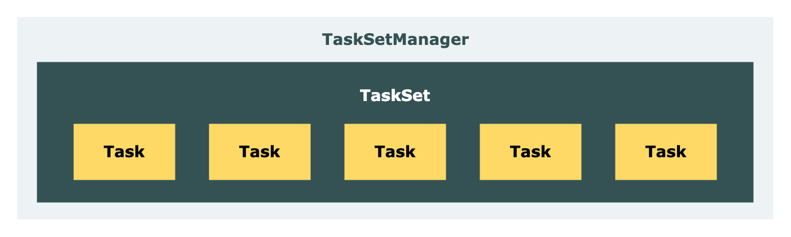

# Spark

## 概念

### Spark 的技术栈有哪些？


1. **Spark Core**：Spark 的基础组件，提供了任务调度、内存管理和错误恢复等功能。它还定义了 RDD（Resilient Distributed Datasets）数据结构，用于在集群上进行分布式计算。
2. **Spark SQL**：用于处理结构化数据的组件，支持使用 SQL 查询数据。它提供了 DataFrame 和 Dataset 两个 API，可以方便地进行数据处理和分析。适合处理大规模的结构化数据。
3. **Spark Streaming**：用于实时数据处理的组件，可以将实时数据流划分为小批次进行处理。它支持各种数据源，如 Kafka、Flume 和 HDFS，并提供了窗口操作和状态管理等功能。适合实时数据分析和流式处理。
4. **Spark MLlib**：用于机器学习的组件，提供了常见的机器学习算法和工具。它支持分类、回归、聚类和推荐等任务，并提供了特征提取、模型评估和模型调优等功能。适合大规模的机器学习任务。
5. **Spark GraphX**：用于图计算的组件，提供了图结构的抽象和常见的图算法。它支持图的构建、遍历和计算，并提供了图分析和图挖掘等功能。适合社交网络分析和图计算任务。

我们主要讨论的是 Spark Core 的部分。

### Spark 为什么快？

#### 为什么比MapReduce 快？

Spark的DAGScheduler相当于一个改进版的MapReduce，如果计算不涉及与其他节点进行数据交换，Spark可以在内存中一次性完成这些操作，也就是**中间结果**无须落盘，减少了磁盘IO的操作。但是，如果计算过程中涉及数据交换，Spark也是会把shuffle的数据写磁盘的！

有同学提到，Spark是基于内存的计算，所以快，这也不是主要原因，要对数据做计算，必然得加载到内存，Hadoop也是如此，只不过Spark支持将需要反复用到的数据给Cache到内存中，减少数据加载耗时，所以Spark跑机器学习算法比较在行（需要对数据进行反复迭代）。Spark基于磁盘的计算依然也是比Hadoop快。

#### Spark为什么比 Hive 快？

1. **消除了冗余的 HDFS 读写**: Hadoop 每次 shuffle 操作后，必须写到磁盘，而 Spark 在 shuffle 后不一定落盘，可以 cache 到内存中，以便迭代时使用。如果操作复杂，很多的 shufle 操作，那么 Hadoop 的读写 IO 时间会大大增加，也是 Hive 更慢的主要原因了
2. **消除了冗余的 MapReduce 阶段**: Hadoop 的 shuffle 操作一定连着完整的 MapReduce 操作，冗余繁琐。而 Spark 基于 RDD 提供了丰富的算子操作，且 reduce 操作产生 shuffle 数据，可以缓存在内存中
3. **JVM 的优化**: Hadoop 每次 MapReduce 操作，启动一个 Task 便会启动一次 JVM，基于进程的操作。而 Spark 每次 MapReduce 操作是基于线程的，只在启动 Executor 是启动一次 JVM，内存的 Task 操作是在线程复用的。每次启动 JVM 的时间可能就需要几秒甚至十几秒，那么当 Task 多了，这个时间 Hadoop 不知道比 Spark 慢了多少.
4. 但是Hive 2.X版本默认使用 MapReduce 作为查询引擎。比较新的 Hive 也是用 Tez, Spark 作为查询引擎，采用了DAG 的执行模型。

### Flink与Spark 的技术选型？

1. **批处理任务**：如果主要任务是大规模的批处理，Spark依然是一个强大的选择，特别是其内存计算模型和Spark SQL的能力。
2. **实时流处理**：对于低延迟、高吞吐量的实时流处理任务，Flink通常是更好的选择。
3. **混合任务**：如果需要同时处理批和流数据，并且希望使用统一的API，Flink的批流统一模型可能更具优势。
4. **机器学习**：在机器学习领域，Spark MLlib仍然是一个强有力的工具，特别是在批处理和离线训练场景中。

### Spark 3.X 有什么新特性？

## RDD(Resilient Distributed Datasets,弹性分布式数据集)

### 为什么使用 RDD？

在RDD之前的计算框架，不善于处理2种应用：迭代式的算法（iterative algorithms）和交互式的数据挖掘工具（ineractive data mining tools）。

> 迭代式的算法: 下一阶段的计算会频繁使用到之前的数据， 例如PageRank，K-means集群算法，逻辑回归算法。
>
> 交互式的程序：程序运行过程中依赖用户的输入来确定下一步的计算。

RDD之前的计算框架，没有很好地复用计算阶段之间的数据。例如，MapReduce框架，计算完一个阶段的数据，将结果输出到外部的静态储存系统，例如，分布式文件系统，这造成数据复制，磁盘I/O，序列化的开销，并且占据了程序运行的大部分时间。而且，这些框架的容错，是通过不同机器之间同步数据/更新日志来实现的。对于数据密集型的应用，这些数据同步的操作使用更多的网络带宽，速度远慢于内存读取。

### RDD的特点

RDD是一个只读的，分片的记录集合。RDD只能通过(1)静态存储中的数据（2）其他RDD来创建。创建RDD的操作被称为 `Transformation`，例如 `map`, `filter`。

`org.apache.spark.rdd/RDD.Scala`中描述, RDD有以下特性：

* 一个partition列表，是数据集的一部分。
* 一个其他RDD的依赖列表。
* 一个函数，用来计算partition的分片。
* partitioner，返回RDD是否hash/范围分片的元数据（可选）
* 列出Partition p能快速访问的节点，基于数据局部性（可选）

### RDD的操作（算子）

RDD的操作分为 `Transformation`和 `Action`，`Transformation`是数据的转换，是延时执行的，只有遇到后面的 `Action`操作才会真正执行。

下面的代码中，`lines`创建了一个来自HDFS文件的RDD，errors是 `lines`创建的RDD。代码运行到到了 Collect( ) 才真正开始进行,  因为他是唯一的 Action 算子。

```
lines = spark.textFile("hdfs://...")
errors = lines.filter(_.startsWith("ERROR"))
errors.persist()
errors.count()


// Count errors mentioning MySQL:
errors.filter(_.contains("MySQL")).count()
// Return the time fields of errors mentioning
// HDFS as an array (assuming time is field
// number 3 in a tab-separated format):
errors.filter(_.contains("HDFS"))
      .map(_.split(’\t’)(3))
      .collect()
```


### 算子的分类

#### 转换算子（transformations）

| **操作**                                                                               | **含义**                                                                                                                                                                                                               |
| -------------------------------------------------------------------------------------------- | ---------------------------------------------------------------------------------------------------------------------------------------------------------------------------------------------------------------------------- |
| **filter** ( *func* )                                                                | 筛选出满足条件的元素，并返回一个新的数据集                                                                                                                                                                                   |
| **map** ( *func* )                                                                   | 将每个元素传递到函数*func* 中，返回一个新的数据集，每个输入元素会映射到 **1 个输出结果**                                                                                                                             |
| **flatMap** ( *func* )                                                               | 与 map 相似，但每个输入元素都可以映射到**0 或多个输出结果**                                                                                                                                                            |
| **mapPartitions** ( *func* )                                                         | 与 map 相似，但是传递给函数*func* 的是每个分区数据集对应的迭代器                                                                                                                                                           |
| **distinct** ( *func* )                                                              | 对原数据集进行去重，并返回新的数据集                                                                                                                                                                                         |
| **groupByKey** ( *[numPartitions]* )                                                 | 应用于 (K, V) 形式的数据集，返回一个新的 (K, Iterable `<V>`) 形式的数据集，可通过 *numPartitions* 指定新数据集的分区数                                                                                                   |
| **reduceByKey** ( *func* ,  *[numPartitions]* )                                    | 应用于 (K, V) 形式的数据集，返回一个新的 (K, V) 形式的数据集，新数据集中的 V 是原有数据集中每个 K 对应的 V 传递到 *func *中进行聚合后的结果                                                                                  |
| **aggregateByKey** ( *zeroValue* )( *seqOp* ,  *combOp* ,  *[numPartitions]* ) | 应用于 (K, V) 形式的数据集，返回一个新的 (K, U) 形式的数据集，新数据集中的 U 是原有数据集中每个 K 对应的 V 传递到*seqOp（partition内的聚合）* 与 *combOp（Partition间的聚合）* 的联合函数且与 *zeroValue* 聚合后的结果 |
| **sortByKey** ( *[ascending]* ,  *[numPartitions]* )                               | 应用于 (K, V) 形式的数据集，返回一个根据 K 排序的数据集，K 按升序或降序排序由*ascending* 指定                                                                                                                              |
| **union** ( *func* )                                                                 | 将两个数据集中的元素合并到一个新的数据集                                                                                                                                                                                     |
| **join** ( *func* )                                                                  | 表示内连接，对于给定的两个形式分别为 (K, V) 和 (K, W) 的数据集，只有在两个数据集中都存在的 K 才会被输出，最终得到一个 (K, (V, W)) 类型的数据集                                                                               |
| **repartition** ( *numPartitions* )                                                  | 对数据集进行重分区，新的分区数由*numPartitions* 指定                                                                                                                                                                       |

**关于 `map` 和 `mapPartitions`：**

* 本质区别在于输入给函数 func 的对象不同，前者是 RDD 中的元素，后者是 RDD 分区数据集对应的迭代器。
* 假如某个 RDD 有 n 个分区，所有分区共有 m 个元素，那么该 RDD 调用 `map` 算子时会触发 m 次 func，而调用 `mapPartition` 时只会触发 n 次 func。在这种区别下，当函数 func 中存在创建连接、读取文件等耗费资源的步骤时，`mapPartition` 的性能会比 `map` 更好。

#### 行动算子（Action）

| **操作**                            | **含义**                                                                                                                    |
| ----------------------------------------- | --------------------------------------------------------------------------------------------------------------------------------- |
| **count** ()                        | 返回数据集中的元素个数                                                                                                            |
| **countByKey** ()                   | 仅适用于 (K, V) 形式的数据集，以 (K, Int) 形式的 Map 返回每个 K 的元素个数                                                        |
| **collect** ()                      | 以数组的形式返回数据集中的所有元素                                                                                                |
| **first** ()                        | 返回数据集中的第一个元素                                                                                                          |
| **take** ( *n* )                  | 以数组的形式返回数据集中的前*n* 个元素                                                                                          |
| **reduce** ( *func* )             | 通过函数*func* （输入两个参数并返回一个值）聚合数据集中的元素                                                                   |
| **foreach** ( *func* )            | 将数据集中的每个元素传递到函数 *func *中运行                                                                                      |
| **saveAsTextFile** ( *path* )     | 将数据集以文本格式写到本地磁盘或 HDFS 的指定目录下                                                                                |
| **saveAsSequenceFile** ( *path* ) | 将数据集以 SequenceFile 格式写到本地磁盘或 HDFS 的指定目录下，仅适用于 (K, V) 形式且 K 和 V 均实现了 Hadoop Writable 接口的数据集 |
| **saveAsObjectFile** ( *path* )   | 将数据集序列化成对象保存至本地磁盘或 HDFS 的指定目录下                                                                            |

### RDD 的依赖关系

在计算逻辑中，不可避免的会出现 RDD 转换的过程，即旧的 RDD 调用转换算子生成新的 RDD。

通常，我们称旧 RDD 为父 RDD，新 RDD 为子 RDD。在这个转换的过程里，新旧 RDD 自然会建立起类似父子的联系，这个联系从概念来说便是 RDD 的依赖关系，在代码层面由抽象类 **Dependency** 表示。

#### 宽窄依赖

*掌握宽窄依赖，是后续学习 RDD 阶段划分的基础，而 RDD 阶段划分，又是学习 Spark 任务划分的前提。这一系列知识，将有助于我们了解一个计算应用在提交后的执行过程。*

1. 宽依赖(ShuffleDependency)：多个子RDD的Partition依赖一个父RDD的Partition。例如一个 reduceBykey 就是一次造成宽依赖的shuffle计算：
2. 窄依赖(NarrowDependency)：每一个父RDD的一个Partition只被一个子RDD的Partition使用，或者多个父RDD指向一个子RDD分区。


下图中的蓝色方框表示的是 partition。


窄依赖的RDD，支持同一个节点内的数据的流水线执行，不需要数据在节点之间的传输。与MapReduce比较，节省了数据传输的花销。而宽依赖的RDD，需要多个父RDD的数据，需要多个节点之间数据的shuffle，来传输数据。窄依赖的RDD，节点故障后的恢复更为高效，只需要重新计算丢失的RDD数据。而宽依赖的RDD，一个节点故障后，需要从宽依赖的继承图中的祖先节点，开始重新计算。

### RDD的血缘关系（Lineage）

血缘关系是 RDD 的重要特性之一，基于 RDD 核心属性 `dependencies` 实现，它描述了一个 RDD 是如何从初始 RDD 计算得来的。


图例展现了一个 Spark 应用从输入到输出的过程。在该过程中，存在着一系列 RDD 的创建与转换，Spark 会记录转换过程中各个 RDD 的依赖关系，并在 RDD F 调用行动算子后构建 DAG 图，触发真正的计算。

将上述过程中 RDD 的依赖关系串联起来，便形成一个血缘关系（Lineage）。在血缘关系中，下一代的 RDD 依赖于上一代的 RDD。以图例说明，B 依赖于 A，D 依赖于 C，E 依赖于 B 和 D。

*血缘关系的存在使 RDD 具备了容错性。当 RDD 的部分分区数据丢失时，Spark 可以通过血缘关系获取足够的关联信息，进而重新计算并恢复丢失的分区。*

### RDD的持久化

RDD 持久化是 Spark 中一个很重要的特性。通过这个特性，Spark 可以在内存或磁盘缓存某个 RDD，当其他行动算子需要这个 RDD 时直接复用它，以  **避免重新计算** ，进而提高性能。

我们通过一个例子对 RDD 持久化展开说明：


假设某个计算任务有 3 个阶段：

* STEP 01 从 HDFS 读取文件并创建 RDD A
* STEP 02 通过转换算子基于 RDD A 生成 RDD B
* STEP 03 通过行动算子基于 RDD B 输出两个结果

如果没有缓存机制，STEP 03 将会触发两次完整的计算，即 STEP 01 → STEP 02 → STEP 03 将完整执行两次。

如果使用了缓存机制，STEP 03 在输出 result2 时，将直接复用 result1 中已缓存的 RDD B，RDD B 之前的计算环节不会被重新执行。

#### 复用原理

* 无论缓存是否开启，基于 RDD B 拆解出的计算任务都会被重复调度
* 基于 RDD B 拆解出的计算任务在重复发布到 Executor 执行时，会直接读取缓存中的计算结果，不会触发实际的计算

Executor 端执行任务的源码，具体过程如下图：


其中 **步骤 4** 的 BlockResult 便是我们想要的缓存结果。若 BlockResult 有值，直接返回给 Executor，不再触发计算；若 BlockResult 为空，则需要执行计算再返回结果。

#### 存储级别

在代码中，我们可以使用 `cache()` 方法或者 `persist()` 方法来指定持久化。其中，`persist()` 方法存在一个名为 **存储级别** 的参数，该参数将决定 RDD 持久化具体的存储位置与存储行为。

`cache()` 实际上调用的是 `persist(StorageLevel.MEMORY_ONLY)` 方法，即基于内存缓存 RDD。

| **持久化级别** | **含义**                                                                                                     |
| -------------------- | ------------------------------------------------------------------------------------------------------------------ |
| MEMORY_ONLY          | 将 RDD 以反序列化 Java 对象的形式存储在 JVM 中，如果大小超过可用内存，则超出部分不会缓存，需重新计算               |
| MEMORY_AND_DISK      | 将 RDD 以反序列化 Java 对象的形式存储在 JVM 中，如果大小超过可用内存，则超出部分会存在在磁盘上，当需要时从磁盘读取 |
| DISK_ONLY            | 将所有 RDD 分区存储到磁盘上                                                                                        |
| MEMORY_ONLY_SER      | 将 RDD 以序列化 Java 对象的形式存储在 JVM 中，具有更好的空间利用率，但是需要占用更多的 CPU 资源                    |
| MEMORY_AND_DISK_SER  | 将 RDD 以序列化 Java 对象的形式存储在 JVM 中，如果大小超过可用内存，则超出部分会存在在磁盘上，无需重新计算         |
| MEMORY_ONLY_2        | 与 MEMORY_ONLY 级别相同，存在副本                                                                                  |
| MEMORY_AND_DISK_2    | 与 MEMORY_AND_DISK 级别相同，存在副本                                                                              |

官方使用建议：

**Tip 01** 如果 RDD 与默认存储级别 `MEMORY_ONLY` 契合，就选择默认存储级别。

**Tip 02** 如果 RDD 与默认存储级别 `MEMORY_ONLY` 不契合，则尝试使用 `MEMORY_ONLY_SER` 并选择一个合适的序列化库，这支持 Spark 在具备较高空间利用率的情况下依旧支持快速访问。

**Tip 03** 尽量不要将缓存数据写到磁盘上，除非数据量特别大或者需要过滤大量数据，因为重新计算的速度与从硬盘读取数据的速度相差不多。

**Tip 04** 如果想要具备故障快速恢复能力，可以选择带有副本的存储级别。当然，没有副本的存储级别并非是不安全的，它们同样具备容错机制，只是在故障恢复时需要重新计算，无法像带有副本的存储级别那样直接通过副本恢复。

### RDD 的检查点（Checkpoint）

检查点是 RDD 的一种容错保障机制，由 RDD 的 `checkpoint()` 方法触发。它主要做了两件事：

* 重新计算调用了 `checkpoint()` 方法的 RDD，并将计算结果保存至外部存储（本地文件系统、分布式文件系统等）
* 切断原有的血缘关系

乍看之下，会觉得检查点与持久化非常相似，都有保存 RDD 计算结果的功能，但实际上两者还是有所区别的：

| 区别项   | RDD 持久化                     | RDD 检查点                   |
| -------- | ------------------------------ | ---------------------------- |
| 生命周期 | 应用结束便删除                 | 永久保存                     |
| 血缘关系 | 不切断                         | 切断                         |
| 使用场景 | 支持在同一个应用中复用计算结果 | 支持在多个应用中复用计算结果 |


图中的 **步骤 4** 表明，**检查点机制本质上就是再执行一遍 RDD 的计算逻辑，然后将计算结果保存至外部存储。**

*官方建议，使用 `checkpoint()` 前最好通过 `cache()` 缓存计算结果，以避免检查点存储快照时发生重复计算。*

## Spark 共享变量？

问题：
算子中对算子外的变量进行计算，然而最终的计算结果不符合预期：

```
val rdd: RDD[Int] = sc.makeRDD(List(1, 2, 3, 4))

var sum: Int = 0
rdd.foreach(num => {
  sum += num
})

println("sum => " + sum)
```

使用这段代码进行求和计算，`sum` 的最终结果为 `0`。

示例中 `sum += num` 是分发到 Executor 端计算的。在各节点的 Executor 开始计算前，会拷贝一份 `sum` 到其本地，然后执行 `sum += num`。但是，在最终 Executor 返回计算结果给 Driver 时，并不会将 `sum` 这种非 RDD 内部数据的普通变量一并返回，因此我们在 Driver 中所看到的 `sum` 变量实际上并没有参与计算，依旧是初始值 `0`

### 累加器（Accumulators）


使用示例

```
 val rdd: RDD[Int] = sc.makeRDD(List(1, 2, 3, 4))
  
    val sumAccumulator: LongAccumulator = sc.longAccumulator("sum")
    rdd.foreach(num => {
      sumAccumulator.add(num)
    })

    println("sum => " + sumAccumulator.value)
```

### 广播变量（Broadcast Variables）

## Spark 任务调度？

面试问题：一个Spark job是怎么跑起来的？

### Spark 有三大组件组成：


1. Cluster Manager：

   1. 负责管理集群资源，包括节点的分配和监控。
   2. 它接受来自Driver的资源请求，并在集群中分配相应的Executor进程。
   3. Cluster Manager可以是Spark自带的Standalone模式，也可以是其他资源管理器，如YARN、Mesos或Kubernetes。
2. Driver（SparkContext）

   1. 作为Spark应用程序的驱动程序，负责提交Spark作业，并且是用户程序与Spark集群之间的桥梁。
   2. 它包含SparkContext对象，该对象初始化作业，并负责构建DAG（有向无环图）。
   3. Driver程序还负责划分DAG为多个Stage，并将任务分配给Executor执行。
3. Executor（进程）与task（线程）

   1. Executor是运行在集群节点上的进程，负责执行Driver分配的任务。
   2. 每个Executor包含多个Task线程，每个Task线程执行一个任务。
   3. Executor还负责管理其节点上的内存和存储资源，以及与外部存储系统（如HDFS）的交互。

### 概述（[参考](https://blog.csdn.net/benjam1n77/article/details/126513983)）

#### Job,Stage,Task


**第一方面，是理清 Application、Job、Stage、Task 的含义及关联。**

首先，Job=多个stage，Stage=多个同种task, Task分为ShuffleMapTask和ResultTask，Dependency分为宽依赖（ShuffleDependency）和窄依赖（NarrowDependency）。

* Application： 用户提交的Spark应用程序。
* Job：Spark作业，是 Application 的子集。Spark 中的算子分为 transformation 和 action，一个 action就会触发一个 Job。
* Stage: 一个Job会被划分为多个 Stage， Stage 以宽依赖为划分的依据。Shuffle前后的 RDD 属于不同的stage。
* Task：一个 Stage 包含一个或者多个 Task，Task对应单个线程，会被封装成 TaskDescription 对象提交到 Executor 的线程池中执行。一个stage的task数量由最后一个 RDD的 partition 数量决定。

**第二方面，是了解 Driver 和 Executor 在任务调度中扮演的角色。**

Driver 是运行用户程序 `main()` 函数并创建 SparkContext 的实例，是任务调度中最为关键的部分。

在一个完整的任务调度中，用户提交的程序会经历 ***Application → Job → Stage → Task*** 的转化过程，而这整个转化过程，由 Driver 的 3 大核心模块共同完成，它们的名称与职责如下表所示：

* DAGScheduler：根据RDD的依赖关系，将Job划分为一个或多个Stage，每个Stage会依据最后一个RDD的partition的数量生成一个或多个Task，同一Stage的Task属于同一TaskSet（任务集），DAGScheduler向TaskScheduler提交任务是以TaskSet为单位。
* TaskScheduler：接收来自DAGScheduler提交的TaskSet，向Executor分发Task。
* SchedulerBackend：TaskScheduler与Executor进行RPC通信的后台。调度后端，维持与 Executor 的通信，并负责将 Task 提交到 Executor。

Executor 是执行实际计算任务的实例，是任务调度的终点，它包含以下核心模块：

* ThreadPool: 任务执行的线程池，用于执行Driver提交的 Task。
* Blockmanager:存储管理器，为RDD提供缓存服务，提高计算速率。
* ExcutorManager:Executor调度后端，维持与Driver的通信，将计算结果返回给 Driver。

*DAG（Directed Acyclic Graph）是一个有向无环图，由点和线组成，该图具有方向，不会闭环。*

### 调度流程

Spark 任务调度基本上会经历  ***提交 → Stage 划分 → Task 调度 → Task 执行*** ，这个过程大致可以描述为：

1. 用户提交一个计算应用（Application）
2. Driver 执行用户程序中的 `main()` 方法，根据行动算子提取作业（Job）
3. DAGScheduler 解析各个作业的 DAG 进行阶段（Stage）划分和任务集（TaskSet）组装
4. TaskScheduler 将任务集发送至任务队列 rootPool
5. SchedulerBackend 通过 Cluster Manager 获取 Executor 资源，并将任务（Task）发送给 Executor
6. Executor 执行计算并管理存储块（Block）
7. Driver 最终从 Executor 获得计算结果，汇总后返回给用户

该过程也可以使用流程图来表示：


### Stage划分

Stage 划分是任务调度的第一步，由 DAGScheduler 完成，它决定了  **一个 Job 将被划分为多少个 TaskSet** 。

#### 基本概念

相较于 Task，Stage 的定义显得难以理解。在官方定义上，**Stage 是一个并行任务（Task）的集合，这个集合上的 Task，都来源于同一个 Job，具有相同的计算逻辑。**

对于部分初学者来说，看到 Stage 的概念可能有此困惑：已知 Task 是实际执行计算任务的单元，为何还需要 Stage 这个集合的概念？将 Job 直接拆分成一系列 Task 然后提交执行不就好了吗？实际上，一个计算作业的执行绝不是简单地拆分、提交 Task 那么简单，它还需要考虑 Task 之间的执行顺序、数据流转等问题。

以 WordCount 为例，计算需要经历 `flatMap` → `map` → `reduceByKey` 的过程，其中 `reduceByKey` 需要在获取前序阶段的所有计算结果后才可以运行。在分布式计算中，由于数据是分散在多个节点的，计算任务会被分发到各节点执行，如果不考虑 Task 执行顺序的话，那么一旦 `reduceByKey` 提前运行，用户将得到错误的结果。因此，必须有一个 Task 调度机制，告诉 Spark 集群哪些 Task 先执行、哪些 Task 后执行。而这，便是 Stage 存在的意义，是它帮助 Spark 任务调度构建了蓝图。

#### 划分规则

Stage 的划分方式可以简述为： **在 DAG 中进行反向解析，遇到宽依赖就断开，遇到窄依赖就把当前的 RDD 加入到当前的阶段中。** 之所以这样划分，是因为宽依赖的位置意味着 Shuffle 的发生，表示这个位置后的 RDD 需要等待前序 RDD 计算完成后才可以开始计算。

下图为 Stage 划分的示例：


在这个示例中，DAGScheduler 反向解析，在 ***RDD B → RDD A*** 和 ***RDD G → RDD F*** 间发现  **ShuffleDependency** ，于是在这两个位置进行阶段划分，分别得到 Stage 01、Stage 02 和 Stage 03。其中，Stage 01 和 Stage 02 的类型为  **ShuffleMapStage** ，而 Stage 03 的类型为  **ResultStage** 。

*ShuffleDependency 保存在 Shuffle 后面的 RDD 中，但是在阶段划分时，会赋予 Shuffle 前的 Stage。例如，RDD B 的 ShuffleDependency 会赋予 Stage 01 的 ShuffleMapStage，以便于 ShuffleMapTask 可以获取到 ShuffleDependency 中的重要信息。这一点，在后续的 Shuffle 教程中得以体现。*

#### 代码实现


该图为 DAGScheduler 中关于阶段划分的源码实现，简单来说就是：

1. 用户提交作业，`handleJobSubmitted` 方法通过最后一个 RDD 解析出 ResultStage并提交给 `submitStage` 方法
2. `submitStage` 方法调用 `getMissingParentStages` 反向解析，提取 ResultStage 的 Parent Stage
3. 若无 Parent Stage，直接调用 `submitMissingTasks` 方法，生成该阶段下的 TaskSet
4. 若存在 Parent Stage，将其添加到到队列 `waitingStages` 中
5. 当前序任务完成，`handleTaskCompletion` 会从 `waitingStages` 取出剩余的 Stage（可能既有 ShuffleMapStage 和 ResultStage）并提交，直至生成所有阶段的 TaskSet

*可以看出，Stage 划分的最终产物是 TaskSet，它是一组 Task 序列， **与 Stage 是一一对应的关系** ，其中的 Task 均来自于同一个 Stage，**且 Task 数量与 Stage 中最后一个 RDD 的分区数一致。***

### RPC模块

通过 Stage 划分，我们已经获得了任务集 TaskSet，可以进入到 Task 调度阶段。但是，Task 调度阶段中包含了大量 RPC 交互过程，因此我们有必要提前了解一下 Spark 的 RPC 模块。

### Task调度

Task 调度是本文最后一节也是最为核心的部分。它是一个非常复杂的过程，涉及到 DAGScheduler、TaskScheduler、SchedulerBackend、ExecutorBackend、Executor 等多个模块。

一个相对完整的 Task 调度流转图如下所示：


*调度流程图根据 Standalone 模式下的流转情况进行绘制，Local、Yarn 等模式下的流转过程会有些许区别。*

在这个流转图中，我们可以将 Task 调度大致分为 5 个阶段：

* 初始化阶段：初始化 TaskScheduler 和 SchedulerBackend 的阶段
* 提交阶段：任务提交到任务池 rootPool 的阶段
* 启动阶段：从任务池 rootPool 取出任务并发布到 Executor 的阶段
* 执行阶段：Executor 执行计算任务并存储计算结果的阶段
* 回收阶段：任务回收、状态更新与资源释放的阶段

#### 初始化阶段

在前面，我们提到过：

* TaskScheduler 是 Task 调度器，负责 Task 的管理，包括提交（提交给任务池 rootPool）、回收、销毁等
* SchedulerBackend 是调度后端，负责与 Executor 保持通信，并负责 Task 的提交（提交给 Executor）

所谓初始化阶段便是 SparkContext 调用 `createTaskScheduler` 方法创建 TaskScheduler 和 SchedulerBackend 实例并完成初始化的过程，其流程图如下所示：


在初始化阶段，TaskScheduler 主要完成以下工作：

* 初始化 SchedulableBuilder，决定任务调度策略，创建任务池 rootPool
* 启动 SchedulerBackend

SchedulerBackend 主要完成以下工作：

* 创建并维持与 Executor 间的 RPC 连接
* 申请 Executor 资源


受限于篇幅，本文仅介绍 Standalone 模式下申请 Executor 的过程，对其他模式不展开介绍，其过程如下：


在这个过程中，Executor 的创建发生在 CoarseGrainedExecutorBackend。它是 Executor 的调度后端，会建立与 Driver 的通信连接，然后创建 Executor 实例并将 Executor 的信息传递给 Driver。接收到 Executor 资源后，Driver 端的SchedulerBackend 会将 Executor 资源放入 `executorDataMap`，等待 Task 调度时提取。


#### 提交阶段

提交阶段由 TaskScheduler 的 `submitTasks` 方法触发，它主要完成以下工作：

* 创建 TaskSetManager
* 将 TaskSetManager 添加至任务池 rootPool

在这个过程中，存在着两个核心角色：TaskSetManager 和 SchedulableBuilder。


**TaskSetManager**

TaskSetManager 由 TaskScheduler 封装 TaskSet 而来，是 TaskScheduler 进行任务调度的基本单元：



TaskSetManager 负责监控和管理同一个 Stage 中的任务集（包括 Executor 资源的匹配、任务执行结果的处理等），同时也负责管理本地化调度级别 TaskLocality。

*本地化调度是“移动计算”的具体实现，是影响 Spark 性能的关键部分，我们将在启动阶段进行详细介绍。*

TaskSetManager 有 3 个核心方法：

| **方法名**                                                                                     | **功能描述**                                                                                            |
| ---------------------------------------------------------------------------------------------------- | ------------------------------------------------------------------------------------------------------------- |
| **resourceOffer** ( *execId* ,  *host* ,  *maxLocality* ,  *taskResourceAssignments* ) | 为一个任务分配一个 Executor 资源，以描述符 TaskDescription 返回，该描述符包含了 Task、Executor 及依赖包等信息 |
| **handleSuccessfulTask** ( *tid* ,  *result* )                                             | 标记任务为成功状态，并通知 DAGScheduler 该任务已完成                                                          |
| **handleFailedTask** ( *tid* ,  *state* ,  *reason* )                                    | 标记任务为失败状态，并重新加入调度队列                                                                        |


SchedulableBuilder 负责将 TaskSetManager 添加到任务池 rootPool，它有两种实现类：

* FIFOSchedulableBuilder：对应 FIFO 调度策略，以先进先出的顺序添加 TaskSetManager
* FairSchedulableBuilder ：对应 Fair 调度策略，可通过配置控制入队优先级

#### 启动阶段

启动阶段指从任务池 rootPool 取出任务并发布到 Executor 的过程。

相较于提交阶段，启动阶段的调度逻辑要复杂很多，涉及到  **RPC 通信** 、 **资源的筛选** 、 **任务与资源的匹配** 、**本地化调度** 等。以 Standalone 模式为例，这个过程，简单来说，可以表述为：

1. StandaloneSchedulerBackend 的 `reviveOffers` 方法向 DriverEndPoint 发起 ReviveOffers 请求
2. DriverEndPoint 接收到ReviveOffers 请求，触发 `makeOffers` 方法，筛选出活跃的 Executor 资源，然后以 Seq[WorkerOffer] 的形式发送给 TaskScheduler 的 `resourceOffers` 方法
3. TaskScheduler 获取到 Executor 资源后，会先行过滤，然后通过 `Random.shuffle(offers)` 将 Executor 资源随机排列，以避免 Task 总是落到同一个 Worker 节点
4. 排列好资源后，TaskScheduler 便会从 rootPool 提取 TaskSetManager
5. TaskSetManager 根据 TaskLocation（由 RDD 的 `preferredLocations` 方法计算而来）初始化当前任务集所支持的本地化级别 TaskLocality，并将任务所期望的 `executorId`（Executor 的唯一标识）发送给 PendingTasksByLocality
6. TaskScheduler 以当前支持的最大本地化级别分配 Executor 给 Task
7. 若 Task 存储在 PendingTasksByLocality 的期望 `executorId` 与分配到的 Executor 一致，则认为分配成功，**并从 PendingTasksByLocality 中移除已配对成功的 Task 的下标，以避免重复分配的现象发生**
8. 若 Task 存储在 PendingTasksByLocality 的期望 `executorId` 与分配到的 Executor 不一致，则认为分配失败，此时需要降低当前支持的最大本地化级别，并重新配对，直至配对成功
9. 将配对成功的 Task 与 Executor 封装成 TaskDescription 对象，返回给 DriverEndPoint
10. DriverEndPoint 根据 TaskDescription 中的 `executorId` 从 `executorDataMap` 取得 Executor 的通信地址，然后将序列化后的 TaskDescription 对象发布给 Executor，至此启动阶段结束


***知识扩展：Executor 申请成功的时间晚于 `reviveOffers` 触发的时间，任务会发布失败吗？***

在上述 **步骤 1**和 **步骤 2** 中，Executor 可能在 `reviveOffers` 触发时还来不及启动，此时会返回空的 WorkerOffer 队列给 TaskScheduler。若出现这种情况，任务难道就直接失败了吗？

我们先来看看 DriverEndpoint 的 `onStart` 方法：

```scala
overridedef onStart():Unit={
// Periodically revive offers to allow delay scheduling to work
val reviveIntervalMs = conf.get(SCHEDULER_REVIVE_INTERVAL).getOrElse(1000L)

  reviveThread.scheduleAtFixedRate(()=> Utils.tryLogNonFatalError {
    Option(self).foreach(_.send(ReviveOffers))
},0, reviveIntervalMs, TimeUnit.MILLISECONDS)
}
```

该方法会启动一个定时器线程，默认情况下每隔 `1s` 会向 DriverEndPoint 发起 1 个 ReviveOffers 请求。

看到这里，想必大家都已经知道答案了。**即便SchedulerBackend 的 `reviveOffers` 触发时 Executor 还未启动成功，也不影响后续任务的发布。** 因为定时器线程的循环触发意味着 TaskScheduler 的 `resourceOffers` 方法会被循环调用，这样在后续 Executor 启动成功后它一定有机会获取封装了 Executor 资源的 WorkerOffer 队列以发布任务池中的 Task。

简言之，Driver 会一直通过调用 reviveOffers 

#### 执行阶段


#### 回收阶段


## 运行模式

（1）、Spark On Standalone模式为：TaskSchedule。

（2）、Yarn Client模式为：YarnClientClusterScheduler。

（3）、Yarn Cluster模式为：YarnClusterScheduler。

#### 几种部署方式：spark on yarn-client/ spark on yarn-cluster/spark on standalone

Yarn是什么？做什么的？

## Spark Shuffle

### Shuffle 简介

## 性能调优

1. #### 内存溢出
2. 数据倾斜
3. 

## 名词术语

- Application：用户编写的spark的程序，其中包括一个Driver功能的代码块和分布在集群中多个节点上运行的Executor代码。
- Driver：运行上述的Application的main函数并创建SparkContext，目的是为了准备spark的运行环境，在spark中有SparkContext负责和ClusterManager通信，进行资源的申请、任务的分配和监控等，当Exectutor运行完毕的时候，负责把SparkContext关闭。
- Executor：某个Application运行在Worker节点的一个**进程**，该进程负责某些Task，并且负责将数据存到内存或磁盘上，每个Application都有各自独立的一批Executor，在Spark on yarn模式下，该进程被称为CoarseGrainedExecutor Backend。一个CoarseGrainedExecutor
  Backend有且仅有一个Executor对象，负责将Task包装成taskRuuner，并从线程池中抽取一个空闲线程运行Task，每一个CoarseGrainedExecutor Backend能够运行的Task数量取决于cpu数量。
- Cluster Manager：指的是在集群上获取资源的外部服务，目前有三种类型：
  - Sparkalone：spark的原生的资源管理，由Master负责资源的分配。
  - Apache Mesos：与Hadoop MR兼容性良好的一种资源调度框架。
  - Hadoop Yarn：只要指yarn中的ResourceManager
- Worker：集群中可以运行Application代码的节点，在sparkstandalone模式中是通过slave文件配置的worker节点，在Spark on yarn模式下就是NodeManager节点。
- Task：被送到某个Executor上的工作单元，和HadoopMR中的MapTask、ReduceTask概念一样，是运行Application的基本单位。多个Task组成一个Stage，而Task的调度和管理等是由TaskScheduler负责。

## 参考资料

1. https://liangyaopei.github.io/2021/01/16/apache-spark-rdd-intro/
2. https://magicpenta.github.io/docs/
3. Spark 算子：https://developer.aliyun.com/article/653927
4. Spark 算子源码：https://www.cnblogs.com/ronnieyuan/p/11768536.html
